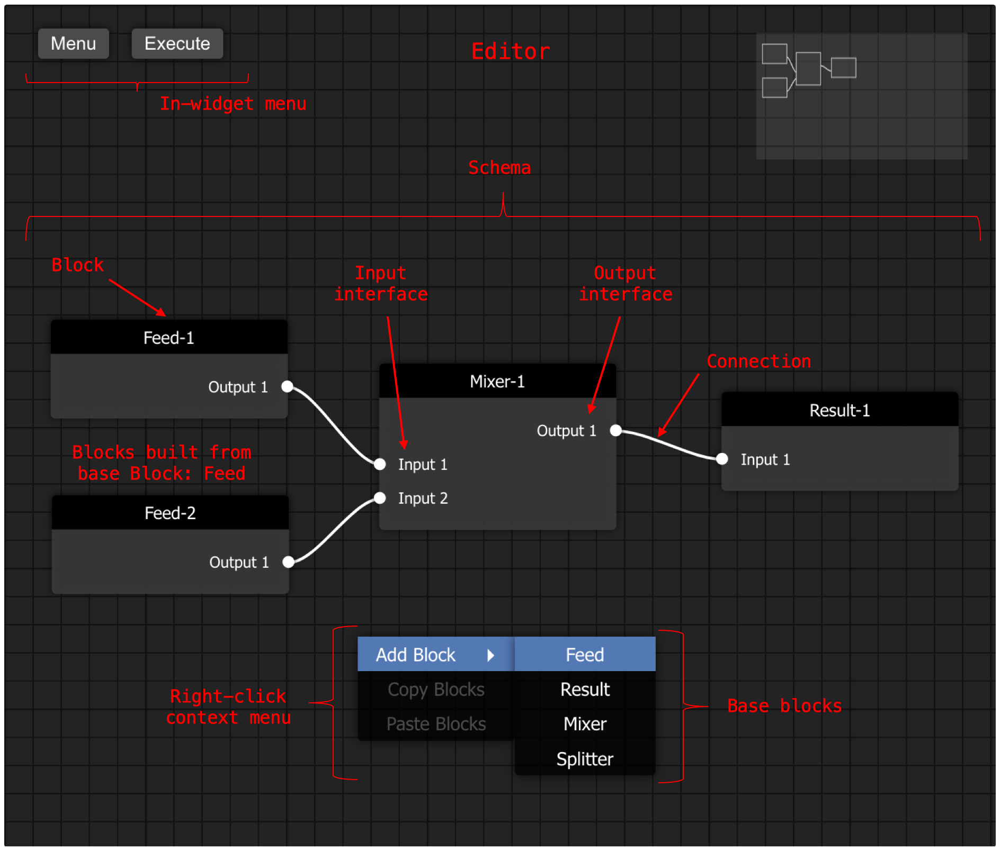

# Introduction

Barfi is a Flow Based Programming environment that provides a graphical programming environment. A schema is built using barfi-Block and barfi-Link provided in the Barfi library. A barfi-ComputeEngine is then used to execute the schema, and the results are obtained. 

Each barfi-Block has come properties that makes this possible. Firstly, each Block has Input and Output interfaces that link to other Blocks. Each Block can carry an executable function, that is specified by the user. This function can access/get data from the Input interface, perform calculations and set the Output interface. 

In general, Barfi is an abstraction of the Graphical Programming, Flow Based Programming or Node programming. Where the Block is synonymous to Node, and a Link is synonymous to an Edge. There are many ways to call this, each serving a specific need or a philosophy. For, Barfi I've kept it simple, so that it can be customized to different use-cases and philosophy. 

## Reference terms

### Block

base_block

### Interface

### Connection

### Schema 

### Visual interface (widget)

